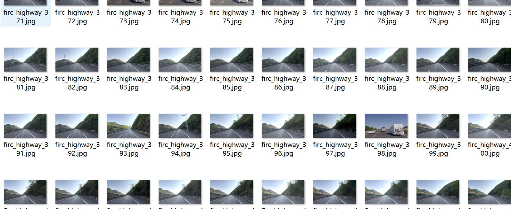
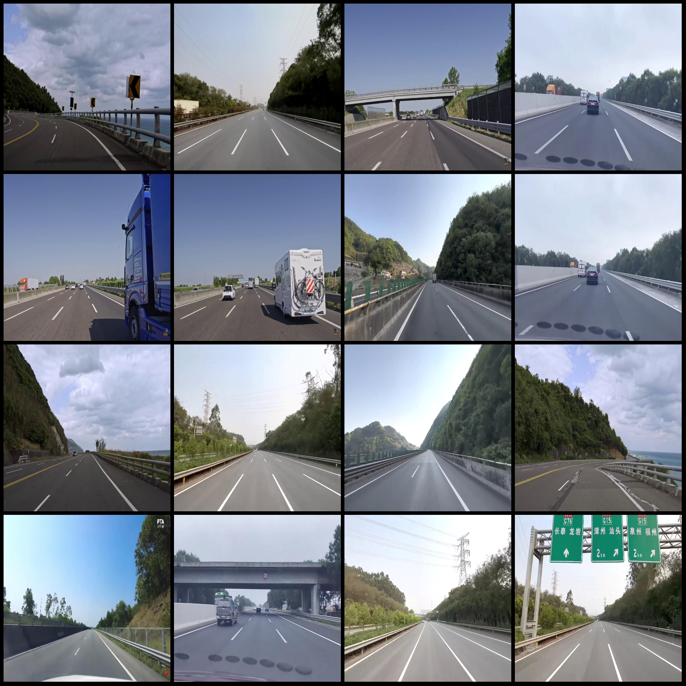
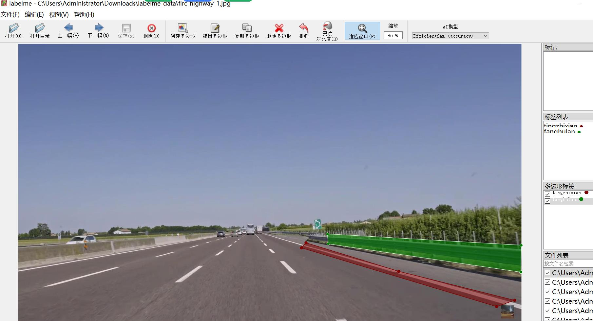

# Smart Traffic Anti-Fence and Stop Line Identification and Segmentation Dataset in LabelMe Format - 1184 Images, 2 Categories with Enhanced

Please note that approximately half of the images in the dataset are originals, while the remaining are enhanced. Please refer to the images.

The dataset format is LabelMe (without a mask file, only including JPG images and their corresponding JSON files).

Number of images: 1184 jpg files
Number of annotations: 1184 
Number of categories: 2
Category names: ["fanghulan", "tingzhixian"]

Number of boxes for each category:
- Fanghulan (anti-fence) count = 1168
- Tingzhixian (stop line) count = 1251
Total number of boxes: 2419

Using labelme tool version: 5.5.0
Image resolution: 1920x1080
Annotation rules: Polygons are drawn around the category

Important Notice: The dataset can be opened and edited using LabelMe, but the JSON dataset needs to be converted into either Yolo or COCO format for semantic segmentation or instance segmentation.
Special Statement: This dataset does not guarantee any accuracy in the training models or weight files.

Image Preview:
Annotation examples:
Randomly selected 16 images:
Annotation drawing results:
LabelMe editing image example:

## Images

Here is a pay link on Stripe ( https://buy.stripe.com/3cs8yP7sY87d0vu9AB ). Please contact me lonlonago@foxmail.com after funding $89, and I will send you a complete data files , thank you!

